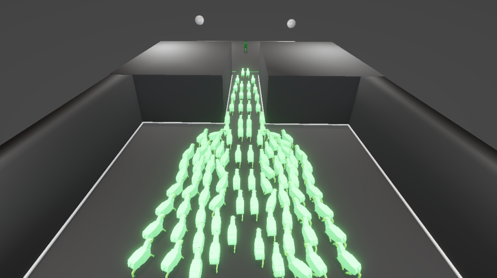
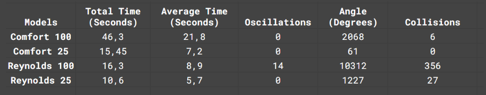

# Steering-Behaviors
Comparison of the Reynolds steering model[1] presented in 1999 by Craig Reynolds and the Comfort Steering Model made by Zhang et al.[2] in 2020. 

**Background:**
The Reynolds steering model is quite simplistic model that is based on euler integration to steer. By changing the velocity and the acceleration vectors in various ways it can accomplish behaviors such as seeking towards a goal or doing obstacle avoidance.

However, its simplicity can lead to problems in dense crowds, such as deadlocks, where an agent using the model become stuck both in walls and also in other agents as an effect of collision, and it also has a problem with being unstable in its motion with such as oscillations, where agents repeatedly rotate between facing toward and away from the exit. 

The Comfort steering model was designed to fix the issues found in the Reynolds model and similar approaches that came after. It aims to maintain a human-like comfortable distances between agents by limiting the velocity, while also constraining steering to avoid steering away from the exit, thereby being more stable in its movement and motion and reducing oscillations.

**Setup:** The setup of the simulation and the comparison was to create a 10x10 meter area with a 2 meter bottleneck and to compare the two models in their performance in evacuating the area with the metrics of time it took for the all the agents to evacuate, the average time for each agent, the average number of oscillations for each agent, the total amount of change in angle for each agent and the average amount of collisions that took place. This simulation was done under low density of agents (25 agents) and high density of agents (100 agents). 

**Results:** 

**Takeaways:**
Here are the average results that I obtained from running each simulation setup 10 times. Since the models are fully deterministic and all agents start from identical position each run, the difference and the variance between the results of each run becomes effectively zero. Meaning that these measurement, besides the total time, are what one can expect from an individual agent using one of these models under these simulation scenarios. 

So, for the results, a clear difference can be observed between the Comfort and Reynolds steering models. Overall, the Comfort model requires a lot more time to evacuate in comparison to the Reynolds model, especially under high densities. This is mainly due to many of the agents of the Comfort model waiting for one another, a behavior that the Reynolds model do not exhibit. This difference becomes clear in the results of collisions where the Comfort model barely causes any collisions whereas the Reynolds model causes a lot of them. 

Furthermore, since the Comfort steering model agents are able to wait for one another and to regulate their velocity they are able to avoid oscillations and turn a lot less than the Reynolds steering model. Under lower densities with only 25 agents, the Reynolds model is quite effective, and since there are fewer agents nearby it is able to avoid oscillations and collisions. Of course, the Comfort Model also works well under lower densities where it barely needs to turn at all.

**Conclussion:**
Both steering models are able to evacuate through a bottleneck under both low and high densities of agents. The older model, the Reynolds model, evacuates in a shorter amount of time than the Comfort model, but it does so by spinning around and colliding with other agents in the process, which means that the model isn’t all that effective to be used in a simulation of a real life scenario. 

Much closer to this is the Comfort Steering model that exhibits more of human-like behaviors of keeping distance to other agents and to wait for others. It can thus avoid oscillations and it can in many cases avoid collision with other agents which means that the goal of the 2020 paper by Zhang et al. seems to be successful from my simulations. 

### References 
PDFs are under folder ./papers. 

[1]: Steering Behaviors for Autonomous Characters, Craig Reynolds (1999) 
[2]: A speed-based model for crowd simulation considering walking preferences, Zhang et al. (2020)
